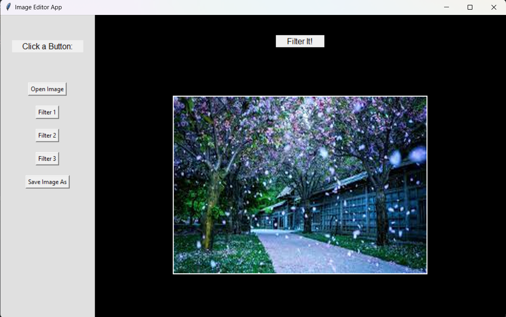

# Image Editor App 🖼️

A desktop image editing application built with **Python**, **Tkinter**, and **Pillow**.  
This app allows users to open images, apply multiple filters, and save the edited images.

---

## 📸 Screenshot


---

## Features ✨
- Open images from your system (`.jpg`, `.png`, `.jpeg`, `.bmp`, `.gif`)
- Apply multiple filters:
  - **Filter 1:** RGB adjustments + brightness enhancement
  - **Filter 2:** Blur, edge enhancement, and contrast adjustments
  - **Filter 3:** Sepia filter
- Save edited images in multiple formats (`.png`, `.jpg`, `.bmp`)
- Placeholder image when no image is loaded
- Interactive GUI with buttons for easy navigation

---

## Technologies 🛠️
- **Python 3.x**
- **Tkinter** – GUI framework
- **Pillow (PIL)** – Image processing

---

## Installation & Dependencies 💻
1. Clone the repository:
   ```bash
   git clone https://github.com/your-username/ImageEditorApp.git
   cd ImageEditorApp
   
2. Install dependencies:
   ```bash
   pip install pillow
   
3. Run the app:
   ```bash
   python main.py